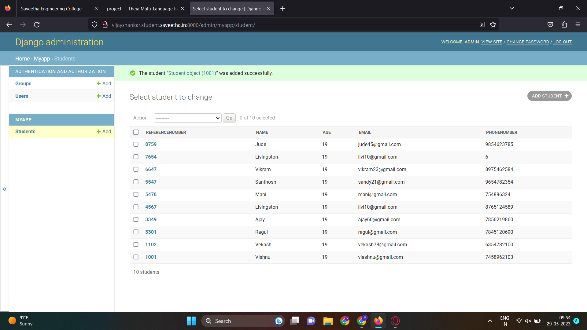

# Django ORM Web Application

## AIM
To develop a Django application to store and retrieve data from a database using Object Relational Mapping(ORM).

## Entity Relationship Diagram

Include your ER diagram here

## DESIGN STEPS

### STEP 1:
clone the repository from github

### STEP 2:
Create an admin interface for Django

### STEP 3:
Create an app and edit settings.py

### STEP 4:
Makemigrations and migrate the changes

### STEP 5:
Create admin user and write Pythin code for admin and models

### STEP 6:
Make all the migrations to 'myapp'

### STEP 7:
Create an empoloyee database with 10 fields using runserver command
Write your own steps

## PROGRAM

```py
admin.py

from django.contrib import admin
from.models import Student,StudentAdmin
# Register your models here.
admin.site.register(Student,StudentAdmin)

models.py

from django.db import models
from django.contrib import admin
# Create your models here.
class Student (models.Model):
    referencenumber=models.CharField(primary_key=True,max_length=4,help_text='reference number')
    name=models.CharField(max_length=100)
    age=models.IntegerField()
    email=models.EmailField()
    phonenumber=models.IntegerField()
    
class StudentAdmin(admin.ModelAdmin):
    list_display=('referencenumber','name','age','email','phonenumber')
```

## OUTPUT




## RESULT

The Progress for Creating an employee database using ORM is executed successfully